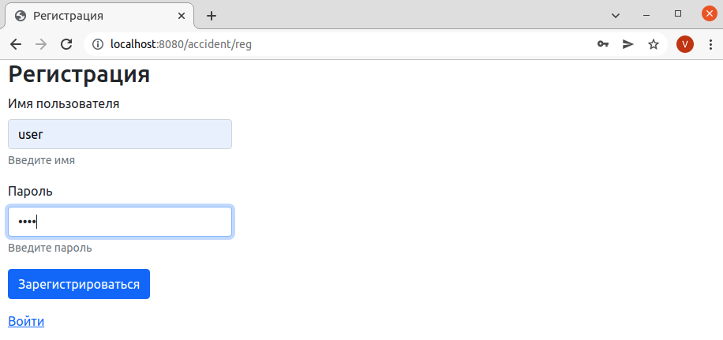
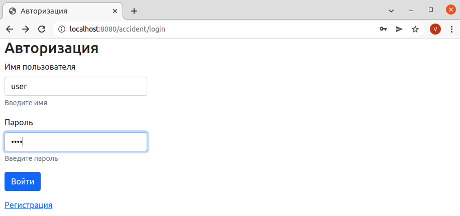
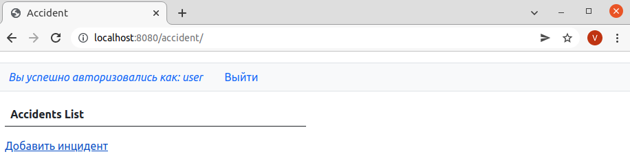
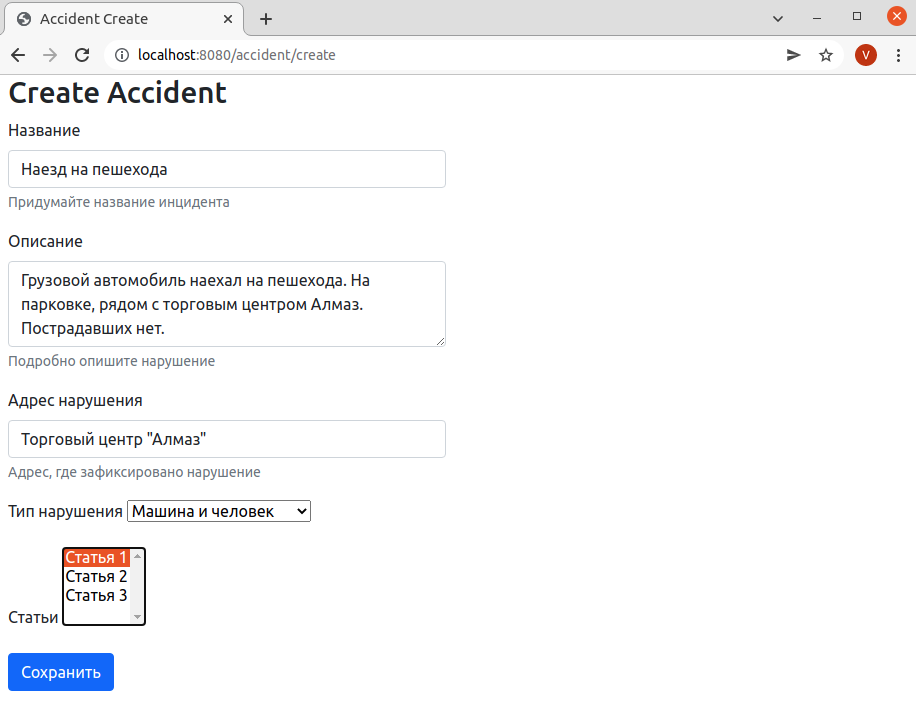
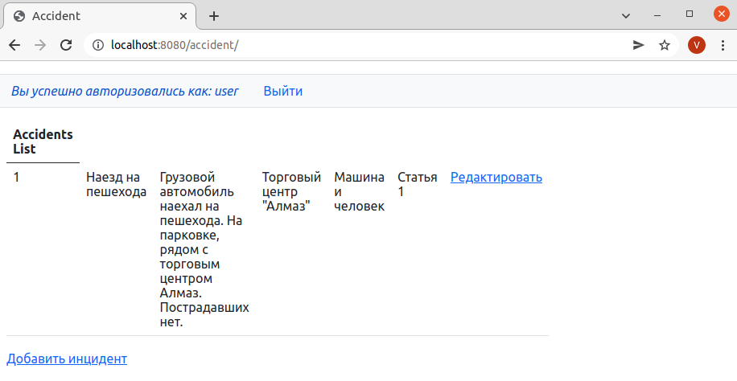

# Приложение Car Accident

## О проекте
#### Описание
Приложение для регистрации нарушений правил дорожного движения. 
В приложении реализована регистрация и авторизация пользователей, а также добавление записей дорожных инцидентов.

#### Технологии
> JDK14, Maven, Spring (MVC, Data, Security), JSP, JSTL, PostgreSQL, Hibernate, JDBC

## Сборка
0. Скачать файлы репозитория
1. Создать базу данных PostgreSQL согласно конфигурации в файле: src/main/resources/app.properties
2. Создать таблицы и заполнить их по сценариям описанным в файлах: db/schema.sql и db/security.schema
3. Произвести сборку проекта: `mvn clean install`
4. Скопировать полученный файл "job4_car_accident-1.0.jar" из папки target в папку вашего сервера
5. Приложение будет доступно по адресу: http://localhost:8080/accident/

## Как пользоваться
При запуске приложения необходимо авторизоваться или зарегистрироваться в нем:

После авторизации пользователю будет доступна возможность добавлять новые записи в журнал инцидентов:

## Контакты
Кутявин Владимир

skype: tribuna87

email: tribuna87@mail.ru

telegram: @kutiavinvladimir
